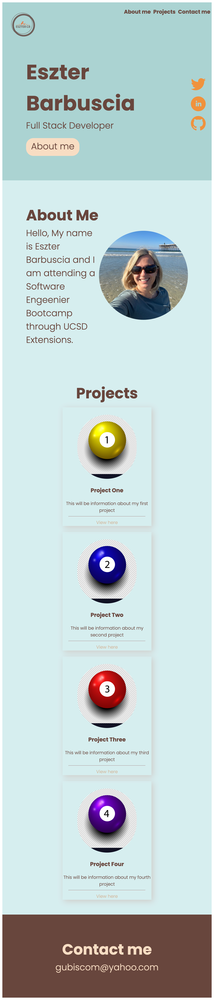

# My Portfolio

## User Story

This is my portfolio website to showcase my knowledge and creaivity to potential employers. Curently the content is full of placeholders to be replaced later when I have actual projects completed

## Acceptance Criteria

Here are the critical requirements necessary to develop a portfolio that satisfies a typical hiring manager’s needs:

```
GIVEN I need to sample a potential employee's previous work
WHEN I load their portfolio
THEN I am presented with the developer's name, a recent photo or avatar, and links to sections about them, their work, and how to contact them
WHEN I click one of the links in the navigation
THEN the UI scrolls to the corresponding section
WHEN I click on the link to the section about their work
THEN the UI scrolls to a section with titled images of the developer's applications
WHEN I am presented with the developer's first application
THEN that application's image should be larger in size than the others
WHEN I click on the images of the applications
THEN I am taken to that deployed application
WHEN I resize the page or view the site on various screens and devices
THEN I am presented with a responsive layout that adapts to my viewport
```

## Description

TBD

## Installation

The link to deployed application is: https://esztergb.github.io/My-Portfolio/



## Usage

This project was created to incorporate informations shared on basic HTML and CSS functvions in the second week of the Bootcamp

## Credits

Thank you for tips and sugestions from Bootcamp instructors and classmates. 
I have used https://www.w3schools.com/ and https://www.stackoverflow.com to research information.
I have reviewed you tube videos from Ania Kubow to help me with this project

## License

N/A - Bootcamp Challange 2